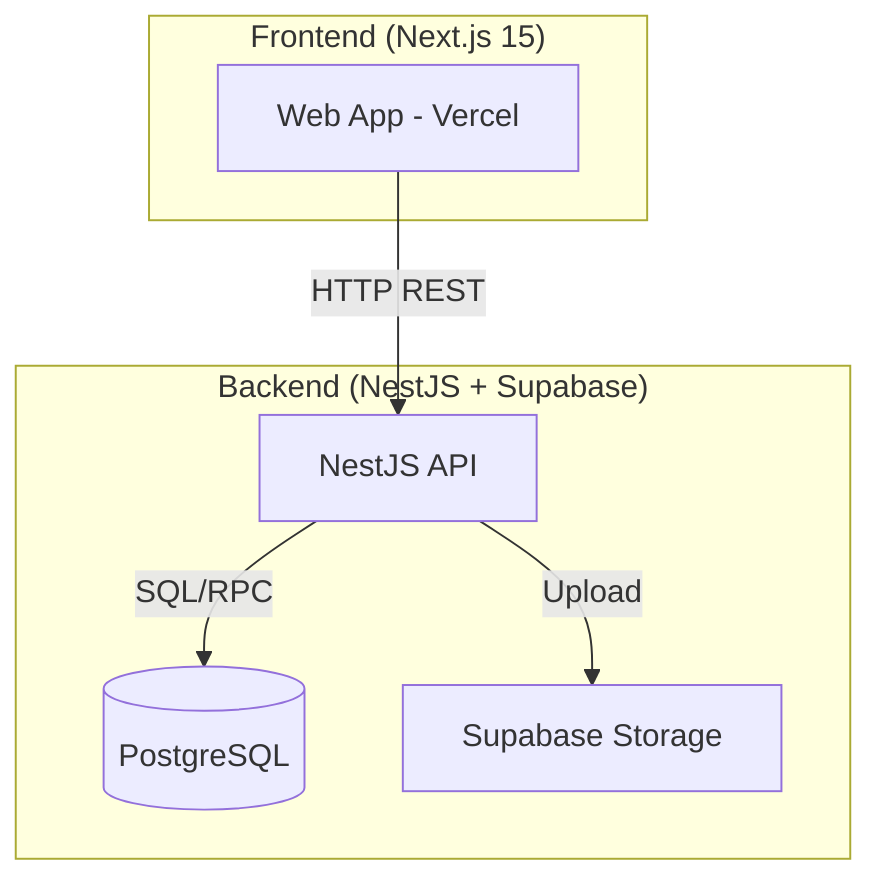

# Phase 3 Completion Plan: African Informal Economy Frontend

## Executive Summary

This plan consolidates all work required to complete Phase 3: building the React frontend that connects to our headless truth ledger backend. The plan covers backend API completion, frontend implementation, and integration testing.

**Target Completion: 10 days**  
**Team: 1-2 developers**  
**Output: Production-ready web application deployed to Vercel**

---

## Architecture Overview



---

## PART 1: Backend API Completion (Days 1-3)

### 1.1 Database Schema Updates

**File:** `supabase/migrations/20260129_add_phase3_features.sql`

```sql
-- Already exists from previous work, verify these are applied:
-- 1. entities.linked_phones TEXT[]
-- 2. entities.alternate_names TEXT[]
-- 3. entities.location TEXT
-- 4. entities.notes TEXT
-- 5. entities.trust_score INTEGER
-- 6. transactions.due_date DATE
-- 7. transactions.context TEXT
-- 8. transactions.tags TEXT[]
-- 9. payment_records table
-- 10. attachments table
```

**Status Check:**
```bash
supabase migration list
supabase migration up
```

### 1.2 New API Endpoints Required

#### Payment Records Controller
**File:** `api/src/payment-records/payment-records.controller.ts`

| Method | Endpoint | Description | Status |
|--------|----------|-------------|--------|
| GET | `/payment-records/transaction/:id` | Get payments for transaction | ⏳ TODO |
| POST | `/payment-records` | Create payment record | ⏳ TODO |
| DELETE | `/payment-records/:id` | Delete payment (DRAFT only) | ⏳ TODO |

#### Attachments Controller
**File:** `api/src/attachments/attachments.controller.ts`

| Method | Endpoint | Description | Status |
|--------|----------|-------------|--------|
| POST | `/attachments/upload` | Upload file to Supabase Storage | ⏳ TODO |
| GET | `/attachments/transaction/:id` | Get transaction attachments | ⏳ TODO |
| GET | `/attachments/entity/:id` | Get entity attachments | ⏳ TODO |
| DELETE | `/attachments/:id` | Delete attachment | ⏳ TODO |

#### Entity Controller Updates
**File:** `api/src/transactions/entities.controller.ts` (new file)

| Method | Endpoint | Description | Status |
|--------|----------|-------------|--------|
| POST | `/entities/:id/linked-phones` | Add linked phone | ⏳ TODO |
| DELETE | `/entities/:id/linked-phones/:phone` | Remove linked phone | ⏳ TODO |
| GET | `/entities/search?phone=` | Search by phone | ⏳ TODO |
| GET | `/entities/:id/balance` | Get entity with balance | ⏳ TODO |
| GET | `/entities/:id/360-view` | Complete entity view | ⏳ TODO |

#### Dashboard Controller
**File:** `api/src/dashboard/dashboard.controller.ts` (new file)

| Method | Endpoint | Description | Status |
|--------|----------|-------------|--------|
| GET | `/dashboard/stats` | Get dashboard statistics | ⏳ TODO |

### 1.3 Service Layer Implementation

**PaymentRecordsService:**
```typescript
// api/src/payment-records/payment-records.service.ts
- createPaymentRecord(dto: CreatePaymentRecordDto)
- getByTransactionId(transactionId: string)
- deletePaymentRecord(id: string) // Only if transaction is DRAFT
```

**AttachmentsService:**
```typescript
// api/src/attachments/attachments.service.ts
- uploadFile(file: Multer.File, dto: UploadAttachmentDto)
- getByTransactionId(transactionId: string)
- getByEntityId(entityId: string)
- deleteAttachment(id: string)
```

**EntityService (Extended):**
```typescript
// api/src/entities/entities.service.ts
- addLinkedPhone(entityId: string, phone: string)
- removeLinkedPhone(entityId: string, phone: string)
- searchByPhone(phone: string, tenantId: string)
- getEntityBalance(entityId: string)
- getEntity360View(entityId: string) // Includes entity, balance, transactions, files, notes
```

**DashboardService:**
```typescript
// api/src/dashboard/dashboard.service.ts
- getDashboardStats(tenantId: string): DashboardStats
  - total_revenue_today/week/month
  - transactions_today/week
  - outstanding_credit/debt
  - payment_method_breakdown
  - top_customers
  - recent_activity
```

### 1.4 DTOs and Types

**CreatePaymentRecordDto:**
```typescript
export class CreatePaymentRecordDto {
  transaction_id: string;
  method: 'CASH' | 'M-PESA' | 'BANK_TRANSFER' | 'CARD' | 'CREDIT';
  amount: number;
  reference?: string;
  paid_at?: string;
}
```

**UploadAttachmentDto:**
```typescript
export class UploadAttachmentDto {
  entity_id?: string;
  transaction_id?: string;
  uploaded_by_user_id: string;
}
```

---

## PART 2: Frontend Implementation (Days 3-8)

### 2.1 Project Setup (Day 3)

**Commands:**
```bash
# Create web directory
mkdir web && cd web

# Initialize Next.js with shadcn
npx shadcn@latest init --yes --template next --base-color neutral

# Install dependencies
npm install swr axios date-fns lucide-react
npm install -D @types/node @types/react @types/react-dom

# Initialize shadcn components
npx shadcn add button card input select table badge dialog tabs
npx shadcn add textarea date-picker popover calendar
npx shadcn add dropdown-menu sheet skeleton
```

### 2.2 Copy UI Components from frontend1 (Day 3)

**Extract List:**
```bash
# UI Components (50+ components)
cp -r ../frontend1/Admin\ Dashboard\ Build/components/ui/* ./components/ui/

# Layout
cp ../frontend1/Admin\ Dashboard\ Build/components/dashboard-shell.tsx ./components/layout/

# Badges
cp ../frontend1/Admin\ Dashboard\ Build/components/status-badge.tsx ./components/badges/

# Utilities
cp ../frontend1/Admin\ Dashboard\ Build/lib/utils.ts ./lib/
cp ../frontend1/Admin\ Dashboard\ Build/lib/helpers.ts ./lib/
```

### 2.3 Build API Client Layer (Day 3-4)

**File Structure:**
```
web/lib/api/
├── client.ts          # Base HTTP client
├── index.ts           # API exports
├── transactions.ts    # Transaction API
├── entities.ts        # Entity API
├── payment-records.ts # Payment API
├── attachments.ts     # File API
└── dashboard.ts       # Dashboard API
```

**Core Client (lib/api/client.ts):**
```typescript
import axios from 'axios';
import useSWR, { SWRConfiguration } from 'swr';

const API_BASE = process.env.NEXT_PUBLIC_API_URL || 'http://localhost:3000/api/v1';

export const apiClient = axios.create({
  baseURL: API_BASE,
  headers: { 'Content-Type': 'application/json' },
});

// SWR fetcher
export const fetcher = (url: string) => apiClient.get(url).then(res => res.data);

// Typed SWR hook
export function useApi<T>(url: string | null, config?: SWRConfiguration) {
  return useSWR<T>(url, fetcher, config);
}

// Mutations with optimistic updates
export async function post<T>(url: string, data: unknown): Promise<T> {
  const response = await apiClient.post(url, data);
  return response.data;
}

export async function patch<T>(url: string, data: unknown): Promise<T> {
  const response = await apiClient.patch(url, data);
  return response.data;
}

export async function del(url: string): Promise<void> {
  await apiClient.delete(url);
}
```

### 2.4 Type Definitions (Day 4)

**File:** `web/lib/types.ts`

Copy from API_CONTRACT.md:
```typescript
export type TransactionType = 'RETAIL' | 'SERVICE' | 'RENTAL' | 'EXPENSE' | 'EXPENSE_RETURN';
export type TransactionStatus = 'DRAFT' | 'POSTED' | 'REVERSED' | 'RECONCILED' | 'VOIDED' | 'ARCHIVED';
export type PaymentStatus = 'PENDING' | 'PARTIAL' | 'PAID' | 'OVERDUE' | 'CREDIT';
export type EntityType = 'CUSTOMER' | 'SUPPLIER' | 'EMPLOYEE';
export type PaymentMethod = 'CASH' | 'MPESA' | 'BANK' | 'CARD' | 'CREDIT' | 'OTHER';

export interface Transaction {
  id: string;
  tenant_id: string;
  entity_id: string;
  created_by_user_id: string;
  type: TransactionType;
  status: TransactionStatus;
  payment_status: PaymentStatus;
  total_amount: number;
  currency_code: string;
  transaction_date: string;
  reference?: string;
  due_date?: string;
  context?: string;
  tags?: string[];
  lines: TransactionLine[];
  payments?: PaymentRecord[];
  attachments?: Attachment[];
  entity?: Entity;
}

// ... etc (full types from API_CONTRACT.md)
```

### 2.5 Page Implementation (Days 4-7)

#### Page 1: Transaction Feed (Day 4)
**File:** `web/app/page.tsx`

**Features:**
- [ ] Transaction table with pagination
- [ ] Filters: status, type, payment_status, date range
- [ ] Search: reference, entity name, SKU
- [ ] Click row → view detail modal
- [ ] Due date badges for credit transactions
- [ ] File attachment indicators
- [ ] Auto-refresh every 30 seconds

**Components:**
- `TransactionTable`
- `TransactionFilters`
- `TransactionDetailModal`
- `StatusBadge`, `PaymentBadge`, `TypeBadge`

#### Page 2: Create Transaction (Day 5)
**File:** `web/app/create/page.tsx`

**Features:**
- [ ] Customer dropdown with search
- [ ] Type selection (RETAIL, SERVICE, RENTAL, EXPENSE)
- [ ] Date picker
- [ ] Reference input
- [ ] **Split Payments**: Add/remove payment methods
  - CASH, M-PESA, BANK_TRANSFER, CARD
  - Amount + reference per payment
- [ ] **Credit/Udhaari**: Toggle + due date picker
- [ ] Context/notes textarea
- [ ] Tags input (comma-separated)
- [ ] Dynamic line items table
  - Description, Quantity, Unit Price, SKU, Account Code
- [ ] Auto-calculate totals
- [ ] Save as Draft button

**Components:**
- `CreateTransactionForm`
- `LineItemsTable`
- `PaymentSplitter`
- `CreditToggle`
- `EntitySearch`

#### Page 3: People/CRM (Day 6)
**File:** `web/app/people/page.tsx`

**Features:**
- [ ] Entity list with balance preview
- [ ] Search by phone number (main or linked)
- [ ] **360° View Modal**:
  - Overview tab: Balance, Trust Score, Location
  - Transactions tab: Full history with running balance
  - Files tab: Attached receipts/notes
  - Notes tab: Communication log
- [ ] "Add Linked Number" button
- [ ] Alternate names display

**Components:**
- `EntityList`
- `Entity360Modal`
- `EntityBalanceCard`
- `AddLinkedPhoneDialog`

#### Page 4: Proof Vault (Day 6)
**File:** `web/app/proof/page.tsx`

**Features:**
- [ ] Upload receipts to transactions
- [ ] Upload files to entities
- [ ] File gallery with thumbnails
- [ ] Download files
- [ ] Filter by: transaction, entity, file type

**Components:**
- `FileUploader`
- `FileGallery`
- `FilePreview`

#### Page 5: Transaction Manager (Day 7)
**File:** `web/app/manager/page.tsx`

**Features:**
- [ ] DRAFT transactions table with Post/Edit/Delete
- [ ] POSTED transactions table with Reverse
- [ ] Credit transactions with due dates
- [ ] Payment records display
- [ ] Upload receipts button
- [ ] Bulk operations (select multiple)

**Components:**
- `DraftTransactionsTable`
- `PostedTransactionsTable`
- `ReverseTransactionDialog`
- `BulkOperationsBar`

### 2.6 Shared Components (Day 7)

**Create/Update:**
- `ErrorBoundary` - Catch API errors
- `LoadingSpinner` - Consistent loading states
- `ToastProvider` - Notifications for actions
- `ConfirmDialog` - Confirm destructive actions
- `DatePicker` - Wrapped shadcn date picker
- `CurrencyInput` - Formatted currency input

### 2.7 Error Handling & Polish (Day 8)

**Error Handling:**
- [ ] API error boundaries
- [ ] Form validation errors
- [ ] Network error retry
- [ ] Optimistic update rollbacks

**Polish:**
- [ ] Loading skeletons
- [ ] Empty states
- [ ] Mobile responsiveness
- [ ] Keyboard shortcuts
- [ ] Print styles for receipts

---

## PART 3: Integration & Testing (Days 8-10)

### 3.1 Integration Checklist

**Transaction Flow:**
- [ ] Create transaction with lines → Verify in DB
- [ ] Post transaction → Verify status change, immutability
- [ ] Reverse transaction → Verify negative amounts, linked ID
- [ ] Create with split payments → Verify payment_records table
- [ ] Create with credit → Verify due_date, payment_status=CREDIT

**Entity Flow:**
- [ ] Create entity → Verify in DB
- [ ] Add linked phone → Verify linked_phones array
- [ ] Search by phone → Find entity by linked number
- [ ] View 360° → All data loads correctly

**File Flow:**
- [ ] Upload to transaction → File in Supabase Storage, record in attachments
- [ ] Upload to entity → Same verification
- [ ] Download file → Works correctly
- [ ] Delete file → Removed from storage and DB

**Dashboard:**
- [ ] Stats match actual transaction data
- [ ] Top customers calculated correctly
- [ ] Revenue numbers accurate

### 3.2 Testing Scenarios

**Critical Path Tests:**
```typescript
// tests/integration/phase3.spec.ts

describe('Phase 3 Critical Path', () => {
  test('Create and post retail transaction with split payment', async () => {
    // 1. Create entity
    // 2. Create transaction with 2 line items
    // 3. Add 2 payment records (CASH + M-PESA)
    // 4. Post transaction
    // 5. Verify all data in DB
  });

  test('Credit transaction with due date', async () => {
    // 1. Create transaction with due_date
    // 2. Verify payment_status = CREDIT
    // 3. Verify appears in credit report
  });

  test('Entity 360 view', async () => {
    // 1. Create entity with linked phones
    // 2. Create multiple transactions
    // 3. Upload files
    // 4. Verify 360 view returns all data
  });

  test('File upload and retrieval', async () => {
    // 1. Upload file to transaction
    // 2. Verify in Supabase Storage
    // 3. Verify attachment record
    // 4. Download and compare
  });
});
```

### 3.3 Performance Testing

- [ ] Transaction list loads < 2 seconds (1000 records)
- [ ] Entity search < 500ms
- [ ] File upload progress indicator
- [ ] Optimistic updates feel instant

### 3.4 Deployment (Day 10)

**Vercel Deployment:**
```bash
# Install Vercel CLI
npm i -g vercel

# Deploy
vercel --prod
```

**Environment Variables:**
```
NEXT_PUBLIC_API_URL=https://api.project-bridge.com/api/v1
NEXT_PUBLIC_SUPABASE_URL=
NEXT_PUBLIC_SUPABASE_ANON_KEY=
```

**Supabase Storage Setup:**
- [ ] Create `attachments` bucket
- [ ] Set public read policy
- [ ] Set authenticated upload policy

---

## PART 4: Success Criteria

### Functional Requirements
- [ ] All 5 pages work with real API data
- [ ] Transaction creation with split payments
- [ ] Credit/udhaari tracking with due dates
- [ ] Entity search by any phone number
- [ ] File upload and download
- [ ] Transaction state transitions (DRAFT → POSTED → REVERSED)

### Non-Functional Requirements
- [ ] Page load < 3 seconds
- [ ] API response < 500ms
- [ ] Mobile responsive
- [ ] Error handling for all API failures
- [ ] Deployed and accessible

### Documentation
- [ ] API endpoints documented
- [ ] Deployment guide updated
- [ ] User guide for features

---

## Daily Standup Checklist

### Day 1
- [ ] Backend: Create PaymentRecords module
- [ ] Backend: Create Attachments module
- [ ] Frontend: Initialize Next.js project

### Day 2
- [ ] Backend: Create Entity extended endpoints
- [ ] Backend: Create Dashboard controller
- [ ] Frontend: Copy UI components
- [ ] Frontend: Build API client

### Day 3
- [ ] Backend: All endpoints tested
- [ ] Frontend: Type definitions
- [ ] Frontend: Transaction Feed page

### Day 4
- [ ] Frontend: Create Transaction page
- [ ] Frontend: Split payments UI

### Day 5
- [ ] Frontend: People/CRM page
- [ ] Frontend: 360° view modal

### Day 6
- [ ] Frontend: Proof Vault page
- [ ] Frontend: Transaction Manager page

### Day 7
- [ ] Frontend: All pages connected to API
- [ ] Frontend: Error handling

### Day 8
- [ ] Integration testing
- [ ] Bug fixes

### Day 9
- [ ] Performance optimization
- [ ] Mobile responsiveness

### Day 10
- [ ] Final testing
- [ ] Deploy to production
- [ ] Documentation

---

## Risk Mitigation

| Risk | Impact | Mitigation |
|------|--------|------------|
| Backend API delays | High | Start with mock API that matches contract |
| File upload complexity | Medium | Use Supabase client library directly |
| Mobile performance | Medium | Implement pagination, lazy loading |
| CORS issues | Low | Configure NestJS CORS before deployment |

---

## Post-Phase 3 Roadmap

**Phase 4: Mobile & Offline**
- React Native app using same API
- Offline-first architecture
- WhatsApp bot integration

**Phase 5: Integrations**
- QuickBooks Online sync
- M-Pesa Daraja API
- SMS notifications

**Phase 6: Intelligence**
- Trust score algorithm
- Fraud detection
- Predictive analytics
