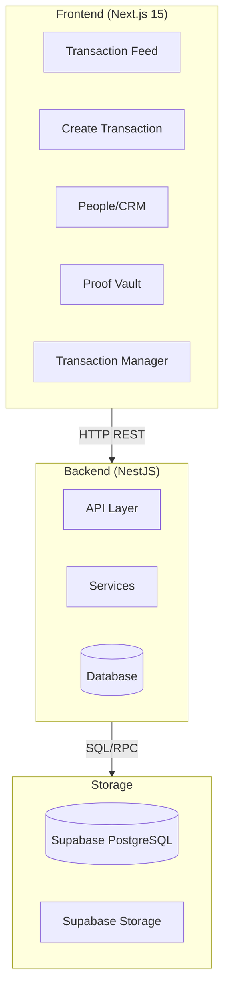

# Phase 3: African Informal Economy - Master Implementation Document

## Executive Summary

**Project Bridge** is a "Headless Truth Ledger" for the African informal economy. This document consolidates all Phase 3 requirements, current implementation status, and the roadmap to completion.

### Current State

| Component | Status | Notes |
|-----------|--------|-------|
| **Frontend (v0)** | ✅ COMPLETE | 5 pages built with Next.js 15, TypeScript, Tailwind, shadcn/ui |
| **Backend API** | ⚠️ PARTIAL | Phase 2 features complete, Phase 3 features pending |
| **Database** | ⚠️ PARTIAL | Core schema ready, Phase 3 schema changes needed |
| **Integration** | ❌ NOT READY | Frontend uses mock data, backend not connected |

---

## 1. Architecture Overview



---

## 2. Frontend Specification (COMPLETE)

### 2.1 Pages

#### Page 1: Transaction Feed
- **URL**: `/`
- **Features**:
  - Table showing: Date, Customer, Type, Amount, Status, Payment Status
  - Filters: Date range, Status dropdown, Type dropdown, Payment Status
  - Search bar for customer name, reference, SKU
  - Click row to view details
  - File attachment indicators
  - Due date badges for credit transactions

#### Page 2: Create Transaction
- **URL**: `/create`
- **Features**:
  - Customer dropdown (with search)
  - Type dropdown: RETAIL, SERVICE, RENTAL, EXPENSE
  - Date picker
  - Reference input
  - **Split Payments**: "Add Payment Method" button
    - Payment methods: CASH, M-PESA (Manual), BANK TRANSFER, CARD
    - Amount and reference per payment
  - **Credit/Udhaari**: "Is this Credit?" toggle
    - Due date picker when enabled
  - **Context/Notes**: Free text field
  - **Tags**: Comma-separated tags
  - Dynamic line items table (add/remove rows)
  - Each line: Description, Quantity, Unit Price, SKU, Account Code
  - Auto-calculate totals
  - Save as Draft button

#### Page 3: People (CRM)
- **URL**: `/people`
- **Features**:
  - Search by any phone number (main or linked)
  - Entity list with balance preview
  - **360° View Modal**:
    - Overview tab: Balance, Trust Score, Location
    - Transactions tab: Full history
    - Files tab: Attached receipts/notes
    - Notes tab: Communication log
  - "Add Linked Number" button
  - Alternate names support

#### Page 4: Proof Vault
- **URL**: `/proof`
- **Features**:
  - Upload receipts to transactions
  - Upload files to entities
  - File gallery with thumbnails
  - Download files
  - Filter by: transaction, entity, file type

#### Page 5: Transaction Manager
- **URL**: `/manager`
- **Features**:
  - DRAFT transactions table with Post/Edit/Delete
  - POSTED transactions table with Reverse
  - Credit transactions with due dates
  - Payment records display
  - Upload receipts button
  - Bulk operations (select multiple)

### 2.2 Frontend Tech Stack
- **Framework**: Next.js 15 (App Router)
- **Language**: TypeScript
- **Styling**: Tailwind CSS
- **UI Components**: shadcn/ui
- **Data Fetching**: SWR
- **State**: React Context + SWR
- **Icons**: Lucide React

### 2.3 Frontend API Client

```typescript
// Base configuration
const API_BASE = process.env.NEXT_PUBLIC_API_URL || 'http://localhost:3000/api/v1';

// Expected API interface
interface ApiClient {
  // Transactions
  getTransactions(filters: TransactionFilters): Promise<Transaction[]>;
  getTransaction(id: string): Promise<TransactionDetail>;
  createTransaction(data: CreateTransactionDto): Promise<Transaction>;
  postTransaction(id: string): Promise<Transaction>;
  reverseTransaction(id: string, reason: string): Promise<Transaction>;
  updatePaymentStatus(id: string, status: PaymentStatus): Promise<Transaction>;
  
  // Entities
  getEntities(): Promise<Entity[]>;
  getEntity(id: string): Promise<EntityDetail>;
  searchEntitiesByPhone(phone: string): Promise<Entity[]>;
  addLinkedPhone(entityId: string, phone: string): Promise<Entity>;
  
  // Payment Records
  getPaymentRecords(transactionId: string): Promise<PaymentRecord[]>;
  createPaymentRecord(transactionId: string, data: PaymentRecordDto): Promise<PaymentRecord>;
  
  // Files
  uploadFile(file: File, entityId?: string, transactionId?: string): Promise<Attachment>;
  getFiles(transactionId?: string, entityId?: string): Promise<Attachment[]>;
  deleteFile(id: string): Promise<void>;
}
```

---

## 3. Backend Specification (PARTIAL - Needs Completion)

### 3.1 Current Implementation (Phase 2 Complete)

#### Existing Endpoints
```
POST   /api/v1/transactions
GET    /api/v1/transactions
GET    /api/v1/transactions/:id
POST   /api/v1/transactions/:id/post
POST   /api/v1/transactions/:id/reverse
PATCH  /api/v1/transactions/:id/payment_status
GET    /api/v1/transactions/:id/export
GET    /api/v1/entities
POST   /api/v1/entities
GET    /api/v1/entities/:id/history
```

#### Existing Database Schema
- `transactions` - Header table
- `transaction_lines` - Line items
- `entities` - Customers/suppliers
- `users` - System users
- `payments` - Payment records (basic)
- `payment_applications` - Payment-transaction links

#### Existing Features
- ✅ Transaction creation with lines
- ✅ State machine (DRAFT → POSTED → RECONCILED)
- ✅ Reversal system
- ✅ Entity management
- ✅ Search and filtering
- ✅ Universal Invoice export

### 3.2 Required Phase 3 Implementation

#### New Database Schema

```sql
-- ============================================
-- PHASE 3 SCHEMA MIGRATIONS
-- Run: supabase/migrations/20260129_add_phase3_features.sql
-- ============================================

-- 1. Update entities table for CRM features
ALTER TABLE entities 
ADD COLUMN IF NOT EXISTS linked_phones TEXT[] DEFAULT '{}',
ADD COLUMN IF NOT EXISTS alternate_names TEXT[] DEFAULT '{}',
ADD COLUMN IF NOT EXISTS location TEXT,
ADD COLUMN IF NOT EXISTS notes TEXT,
ADD COLUMN IF NOT EXISTS trust_score INTEGER DEFAULT 50 CHECK (trust_score >= 0 AND trust_score <= 100);

-- 2. Update transactions table for Phase 3
ALTER TABLE transactions 
ADD COLUMN IF NOT EXISTS linked_transaction_id UUID REFERENCES transactions(id),
ADD COLUMN IF NOT EXISTS due_date DATE,
ADD COLUMN IF NOT EXISTS context TEXT,
ADD COLUMN IF NOT EXISTS tags TEXT[] DEFAULT '{}';

-- 3. Create payment_records table for split payments
CREATE TABLE IF NOT EXISTS payment_records (
  id UUID PRIMARY KEY DEFAULT gen_random_uuid(),
  transaction_id UUID NOT NULL REFERENCES transactions(id) ON DELETE CASCADE,
  method VARCHAR(50) NOT NULL CHECK (method IN ('CASH', 'M-PESA', 'BANK_TRANSFER', 'CARD', 'CREDIT')),
  amount INTEGER NOT NULL CHECK (amount > 0),
  reference VARCHAR(255),
  paid_at TIMESTAMP DEFAULT NOW(),
  metadata JSONB DEFAULT '{}',
  created_at TIMESTAMP DEFAULT NOW()
);

CREATE INDEX IF NOT EXISTS idx_payment_records_txn ON payment_records(transaction_id);

-- 4. Create attachments table for file storage
CREATE TABLE IF NOT EXISTS attachments (
  id UUID PRIMARY KEY DEFAULT gen_random_uuid(),
  entity_id UUID REFERENCES entities(id) ON DELETE CASCADE,
  transaction_id UUID REFERENCES transactions(id) ON DELETE CASCADE,
  file_name VARCHAR(255) NOT NULL,
  file_type VARCHAR(50) NOT NULL CHECK (file_type IN ('IMAGE', 'PDF', 'AUDIO', 'OTHER')),
  file_url TEXT NOT NULL,
  file_size INTEGER,
  uploaded_by_user_id UUID NOT NULL REFERENCES users(id),
  uploaded_at TIMESTAMP DEFAULT NOW(),
  metadata JSONB DEFAULT '{}',
  CONSTRAINT chk_attachment_parent CHECK (
    (entity_id IS NOT NULL) OR (transaction_id IS NOT NULL)
  )
);

CREATE INDEX IF NOT EXISTS idx_attachments_entity ON attachments(entity_id);
CREATE INDEX IF NOT EXISTS idx_attachments_transaction ON attachments(transaction_id);

-- 5. Create function to calculate entity balance
CREATE OR REPLACE FUNCTION calculate_entity_balance(p_entity_id UUID)
RETURNS TABLE(
  total_credit BIGINT,
  total_debit BIGINT,
  net_balance BIGINT
) LANGUAGE plpgsql AS $$
BEGIN
  RETURN QUERY
  SELECT 
    COALESCE(SUM(CASE WHEN type IN ('RETAIL', 'SERVICE', 'RENTAL') THEN total_amount ELSE 0 END), 0)::BIGINT as total_credit,
    COALESCE(SUM(CASE WHEN type = 'EXPENSE' THEN total_amount ELSE 0 END), 0)::BIGINT as total_debit,
    COALESCE(SUM(CASE 
      WHEN type IN ('RETAIL', 'SERVICE', 'RENTAL') THEN total_amount 
      WHEN type = 'EXPENSE' THEN -total_amount 
      ELSE 0 
    END), 0)::BIGINT as net_balance
  FROM transactions
  WHERE entity_id = p_entity_id
  AND status = 'POSTED';
END; $$;

-- 6. Create function to search entities by phone
CREATE OR REPLACE FUNCTION search_entities_by_phone(p_phone TEXT, p_tenant_id UUID)
RETURNS TABLE(
  id UUID,
  display_name TEXT,
  phone_number TEXT,
  linked_phones TEXT[],
  type TEXT
) LANGUAGE plpgsql AS $$
BEGIN
  RETURN QUERY
  SELECT 
    e.id,
    e.display_name,
    e.phone_number,
    e.linked_phones,
    e.type
  FROM entities e
  WHERE e.tenant_id = p_tenant_id
  AND (
    e.phone_number = p_phone 
    OR p_phone = ANY(e.linked_phones)
  );
END; $$;
```

#### New API Endpoints Required

```typescript
// ============================================
// ENTITIES CONTROLLER - Add these endpoints
// ============================================

@Post(':id/linked-phones')
async addLinkedPhone(
  @Param('id') id: string,
  @Body() dto: { phone: string }
): Promise<Entity> {
  // Add a linked phone number to entity
}

@Delete(':id/linked-phones/:phone')
async removeLinkedPhone(
  @Param('id') id: string,
  @Param('phone') phone: string
): Promise<Entity> {
  // Remove a linked phone number
}

@Get('search')
async searchByPhone(
  @Query('phone') phone: string,
  @Query('tenant_id') tenantId: string
): Promise<Entity[]> {
  // Search entities by phone (main or linked)
}

@Get(':id/balance')
async getEntityBalance(
  @Param('id') id: string
): Promise<{
  entity: Entity;
  balance: {
    total_credit: number;
    total_debit: number;
    net_balance: number;
  }
}> {
  // Get entity with calculated balance
}

@Get(':id/360-view')
async getEntity360View(
  @Param('id') id: string
): Promise<Entity360View> {
  // Get complete entity view with:
  // - Entity details
  // - Balance calculation
  // - Recent transactions
  // - Files
  // - Notes
}

// ============================================
// PAYMENT RECORDS CONTROLLER - New Controller
// ============================================

@Controller('api/v1/payment-records')
export class PaymentRecordsController {
  
  @Get('transaction/:transactionId')
  async getByTransaction(
    @Param('transactionId') transactionId: string
  ): Promise<PaymentRecord[]> {
    // Get all payment records for a transaction
  }

  @Post()
  async create(
    @Body() dto: CreatePaymentRecordDto
  ): Promise<PaymentRecord> {
    // Create a payment record
  }

  @Delete(':id')
  async delete(@Param('id') id: string): Promise<void> {
    // Delete a payment record (only if transaction is DRAFT)
  }
}

// ============================================
// ATTACHMENTS CONTROLLER - New Controller
// ============================================

@Controller('api/v1/attachments')
export class AttachmentsController {
  
  @Get('transaction/:transactionId')
  async getByTransaction(
    @Param('transactionId') transactionId: string
  ): Promise<Attachment[]> {
    // Get attachments for a transaction
  }

  @Get('entity/:entityId')
  async getByEntity(
    @Param('entityId') entityId: string
  ): Promise<Attachment[]> {
    // Get attachments for an entity
  }

  @Post('upload')
  @UseInterceptors(FileInterceptor('file'))
  async upload(
    @UploadedFile() file: Express.Multer.File,
    @Body() dto: UploadAttachmentDto
  ): Promise<Attachment> {
    // Upload file to Supabase Storage
    // Save metadata to attachments table
  }

  @Delete(':id')
  async delete(@Param('id') id: string): Promise<void> {
    // Delete from Supabase Storage
    // Delete from attachments table
  }
}
```

#### Updated DTOs

```typescript
// ============================================
// UPDATED CreateTransactionDto
// ============================================

export class CreateTransactionDto {
  // ... existing fields ...

  @IsOptional()
  @IsDateString()
  due_date?: string;  // For credit transactions

  @IsOptional()
  @IsString()
  context?: string;  // Free text notes

  @IsOptional()
  @IsArray()
  @IsString({ each: true })
  tags?: string[];

  @IsOptional()
  @IsArray()
  @ValidateNested({ each: true })
  @Type(() => PaymentRecordDto)
  payment_records?: PaymentRecordDto[];  // Split payments
}

export class PaymentRecordDto {
  @IsString()
  method: 'CASH' | 'M-PESA' | 'BANK_TRANSFER' | 'CARD' | 'CREDIT';

  @IsNumber()
  amount: number;

  @IsOptional()
  @IsString()
  reference?: string;

  @IsOptional()
  @IsDateString()
  paid_at?: string;
}

// ============================================
// NEW UploadAttachmentDto
// ============================================

export class UploadAttachmentDto {
  @IsOptional()
  @IsUUID()
  entity_id?: string;

  @IsOptional()
  @IsUUID()
  transaction_id?: string;

  @IsUUID()
  uploaded_by_user_id: string;
}
```

---

## 4. Implementation Roadmap

### Week 1: Critical Path (MUST HAVE)

#### Day 1-2: Database Schema
- [ ] Create migration file: `supabase/migrations/20260129_add_phase3_features.sql`
- [ ] Run migration on local Supabase
- [ ] Verify all tables created correctly
- [ ] Test with sample data

#### Day 2-3: Entity Service Updates
- [ ] Add linked phone methods
- [ ] Implement search by phone
- [ ] Add balance calculation
- [ ] Create 360° view endpoint

#### Day 3-4: Transaction Service Updates
- [ ] Update create transaction to support split payments
- [ ] Add payment records creation
- [ ] Implement credit/due date handling
- [ ] Update payment status calculation

#### Day 4-5: File Upload Service
- [ ] Create files module
- [ ] Implement upload to Supabase Storage
- [ ] Add file type detection
- [ ] Create attachment records

#### Day 5: Controller Updates
- [ ] Add entity endpoints
- [ ] Create payment records controller
- [ ] Create attachments controller
- [ ] Update transaction controller

### Week 2: Integration & Testing

- [ ] Connect frontend to real API
- [ ] Test all 5 pages with real data
- [ ] Fix CORS issues
- [ ] Handle error states
- [ ] Add loading states

### Week 3: Polish & Deploy

- [ ] Add authentication
- [ ] Deploy backend to production
- [ ] Deploy frontend to Vercel
- [ ] Configure Supabase Storage buckets
- [ ] Test end-to-end workflow

---

## 5. API Reference

### Base URL
```
Development: http://localhost:3000/api/v1
Production:  https://api.project-bridge.com/api/v1
```

### Authentication
```
Header: Authorization: Bearer <token>
```

### Endpoints Summary

| Method | Endpoint | Description |
|--------|----------|-------------|
| GET | /transactions | List transactions with filters |
| POST | /transactions | Create new transaction |
| GET | /transactions/:id | Get transaction details |
| POST | /transactions/:id/post | Post transaction |
| POST | /transactions/:id/reverse | Reverse transaction |
| PATCH | /transactions/:id/payment_status | Update payment status |
| GET | /entities | List entities |
| POST | /entities | Create entity |
| POST | /entities/:id/linked-phones | Add linked phone |
| GET | /entities/search | Search by phone |
| GET | /entities/:id/balance | Get entity balance |
| GET | /payment-records/transaction/:id | Get payment records |
| POST | /payment-records | Create payment record |
| POST | /attachments/upload | Upload file |
| GET | /attachments/transaction/:id | Get transaction files |
| GET | /attachments/entity/:id | Get entity files |

---

## 6. Data Models

### Transaction
```typescript
interface Transaction {
  id: string;
  tenant_id: string;
  entity_id: string;
  created_by_user_id: string;
  type: 'RETAIL' | 'SERVICE' | 'RENTAL' | 'EXPENSE';
  status: 'DRAFT' | 'POSTED' | 'REVERSED' | 'RECONCILED' | 'VOIDED' | 'ARCHIVED';
  payment_status: 'PENDING' | 'PARTIAL' | 'PAID' | 'OVERDUE';
  total_amount: number;
  currency_code: string;
  reference?: string;
  transaction_date: string;
  due_date?: string;  // Phase 3
  context?: string;   // Phase 3
  tags?: string[];    // Phase 3
  linked_transaction_id?: string;  // Phase 3
  reversed_transaction_id?: string;
  metadata: Record<string, any>;
  created_at: string;
  updated_at: string;
  lines: TransactionLine[];
  payment_records?: PaymentRecord[];  // Phase 3
  attachments?: Attachment[];         // Phase 3
}
```

### Entity
```typescript
interface Entity {
  id: string;
  tenant_id: string;
  type: 'CUSTOMER' | 'SUPPLIER' | 'EMPLOYEE';
  display_name: string;
  phone_number?: string;
  linked_phones?: string[];     // Phase 3
  alternate_names?: string[];   // Phase 3
  location?: string;            // Phase 3
  notes?: string;               // Phase 3
  trust_score?: number;         // Phase 3
  metadata: Record<string, any>;
  created_at: string;
  updated_at: string;
}
```

### Payment Record (Phase 3)
```typescript
interface PaymentRecord {
  id: string;
  transaction_id: string;
  method: 'CASH' | 'M-PESA' | 'BANK_TRANSFER' | 'CARD' | 'CREDIT';
  amount: number;
  reference?: string;
  paid_at: string;
  metadata: Record<string, any>;
  created_at: string;
}
```

### Attachment (Phase 3)
```typescript
interface Attachment {
  id: string;
  entity_id?: string;
  transaction_id?: string;
  file_name: string;
  file_type: 'IMAGE' | 'PDF' | 'AUDIO' | 'OTHER';
  file_url: string;
  file_size: number;
  uploaded_by_user_id: string;
  uploaded_at: string;
  metadata: Record<string, any>;
}
```

---

## 7. Environment Setup

### Backend (.env)
```env
# Database
SUPABASE_URL=https://your-project.supabase.co
SUPABASE_SERVICE_KEY=your-service-key

# Server
PORT=3000
NODE_ENV=development

# Storage
STORAGE_BUCKET=attachments
```

### Frontend (.env.local)
```env
NEXT_PUBLIC_API_URL=http://localhost:3000/api/v1
NEXT_PUBLIC_SUPABASE_URL=https://your-project.supabase.co
NEXT_PUBLIC_SUPABASE_ANON_KEY=your-anon-key
```

---

## 8. Testing Checklist

### Backend Tests
- [ ] Create transaction with split payments
- [ ] Create transaction with credit/due date
- [ ] Add linked phone to entity
- [ ] Search entity by linked phone
- [ ] Upload file and verify storage
- [ ] Get entity balance calculation
- [ ] Post transaction with payment records

### Frontend Tests
- [ ] Create transaction with multiple payment methods
- [ ] Mark transaction as credit with due date
- [ ] Upload receipt to transaction
- [ ] Search people by phone number
- [ ] View entity 360° view
- [ ] Filter transactions by payment status
- [ ] Download attached files

### Integration Tests
- [ ] End-to-end transaction creation
- [ ] File upload and retrieval
- [ ] Entity search and balance
- [ ] Payment record creation

---

## 9. Deployment

### Backend Deployment (Railway/Render)
```bash
# 1. Push code to GitHub
git add .
git commit -m "Phase 3 backend complete"
git push origin main

# 2. Connect Railway/Render to GitHub repo
# 3. Set environment variables
# 4. Deploy
```

### Frontend Deployment (Vercel)
```bash
# 1. Push frontend code
cd frontend1/Admin\ Dashboard\ Build
git init
git add .
git commit -m "Initial frontend"
git push origin main

# 2. Import to Vercel
# 3. Set environment variables
# 4. Deploy
```

### Supabase Storage Setup
```sql
-- Create storage bucket for attachments
INSERT INTO storage.buckets (id, name, public) 
VALUES ('attachments', 'attachments', true);

-- Set up RLS policies
CREATE POLICY "Allow authenticated uploads" ON storage.objects
FOR INSERT TO authenticated WITH CHECK (bucket_id = 'attachments');

CREATE POLICY "Allow public read" ON storage.objects
FOR SELECT TO anon USING (bucket_id = 'attachments');
```

---

## 10. Documentation Files

### To Keep (Consolidated)
- `PHASE_3_MASTER.md` (this file) - Single source of truth
- `openapi.yaml` - API specification
- `DEPLOYMENT_CHECKLIST.md` - Deployment steps

### To Archive/Delete (Redundant)
- `PHASE_2_COMPLETE.md` - Historical, archive
- `PHASE_3_AFRICAN_INFORMAL_ECONOMY.md` - Merged into this doc
- `V0_BACKEND_BUILD_PROMPT.md` - Merged into this doc
- `BACKEND_IMPLEMENTATION_PLAN.md` - Merged into this doc
- `IMPLEMENTATION_ROADMAP.md` - Merged into this doc
- `VERCEL_AGENT_*.md` - Context docs, can archive
- `TOOLJET_SETUP_GUIDE.md` - Outdated, archive

---

## 11. Next Steps

1. **Review this document** - Ensure all requirements are captured
2. **Create database migration** - Run the Phase 3 schema changes
3. **Implement backend features** - Follow Week 1 roadmap
4. **Connect frontend** - Replace mock data with real API calls
5. **Test end-to-end** - Verify all 5 pages work correctly
6. **Deploy** - Push to production

---

## Appendix A: Frontend Component Structure

```
frontend1/Admin Dashboard Build/
├── app/
│   ├── page.tsx              # Transaction Feed
│   ├── create/page.tsx       # Create Transaction
│   ├── people/page.tsx       # People/CRM
│   ├── proof/page.tsx        # Proof Vault
│   └── manager/page.tsx      # Transaction Manager
├── components/
│   ├── ui/                   # shadcn/ui components
│   ├── dashboard-shell.tsx   # Layout wrapper
│   ├── transaction-feed.tsx
│   ├── create-transaction-form.tsx
│   ├── people-crm.tsx
│   ├── proof-gallery.tsx
│   └── transaction-manager.tsx
├── lib/
│   ├── api.ts               # API client
│   ├── utils.ts             # Utilities
│   └── types.ts             # TypeScript types
└── hooks/
    ├── use-transactions.ts
    ├── use-entities.ts
    └── use-files.ts
```

## Appendix B: Backend Module Structure

```
api/src/
├── transactions/
│   ├── transactions.controller.ts
│   ├── transactions.service.ts
│   ├── transactions.module.ts
│   └── dto/
│       ├── create-transaction.dto.ts
│       ├── post-transaction.dto.ts
│       └── update-payment-status.dto.ts
├── entities/
│   ├── entities.controller.ts
│   ├── entities.service.ts
│   └── entities.module.ts
├── payment-records/          # NEW
│   ├── payment-records.controller.ts
│   ├── payment-records.service.ts
│   └── payment-records.module.ts
├── attachments/              # NEW
│   ├── attachments.controller.ts
│   ├── attachments.service.ts
│   └── attachments.module.ts
├── supabase/
│   └── supabase.service.ts
└── main.ts
```
