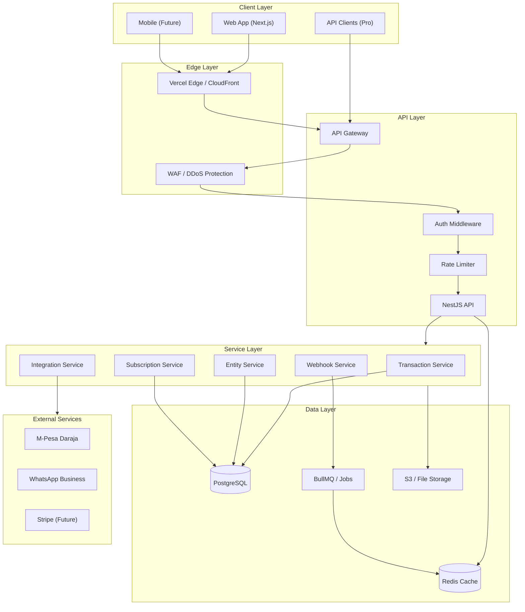

# Phase 4 Architecture: Production Readiness & Scale

## Executive Summary

Phase 4 of Project Bridge transitions from a functional MVP to a production-ready SaaS platform capable of serving multiple tenant tiers. This phase focuses on:

1. **Tenant Tier System**: Implementing Free (Plan 1) and Pro (Plan 2) subscription tiers
2. **Authentication & Authorization**: Row-Level Security (RLS) and proper auth flows
3. **Integration Layer**: M-Pesa, WhatsApp Business API for Pro tenants
4. **Performance & Scale**: Caching, connection pooling, background jobs
5. **DevOps**: CI/CD, monitoring, logging

## Current State (End of Phase 3)

```
┌─────────────────────────────────────────────────────────────┐
│                    Project Bridge v0.3.0                    │
├─────────────────────────────────────────────────────────────┤
│  Frontend: Next.js 15 + shadcn/ui (Port 3001)              │
│  Backend: NestJS + Prisma (Port 3000)                      │
│  Database: Supabase PostgreSQL                             │
├─────────────────────────────────────────────────────────────┤
│  Features:                                                  │
│  ✅ Transaction CRUD + State Machine (DRAFT→POSTED)        │
│  ✅ Entity Management (People/CRM)                         │
│  ✅ Payment Records (Split payments)                       │
│  ✅ Attachment Uploads (Proof Vault)                       │
│  ✅ Dashboard Analytics                                    │
│  ✅ Search & Filtering                                     │
├─────────────────────────────────────────────────────────────┤
│  Gaps:                                                      │
│  ❌ No authentication/authorization                        │
│  ❌ No tenant tier system                                  │
│  ❌ No M-Pesa/WhatsApp integration                         │
│  ❌ No background job processing                           │
│  ❌ No caching layer                                       │
│  ❌ No comprehensive testing                               │
└─────────────────────────────────────────────────────────────┘
```

## Phase 4 Goals

### Goal 1: Tenant Subscription System
**Objective**: Implement Free vs Pro tier differentiation

**Key Deliverables**:
- Database schema for subscriptions (see [`TENANT_TIER_ARCHITECTURE.md`](TENANT_TIER_ARCHITECTURE.md))
- Feature flag system with guards
- Usage tracking and limits
- Upgrade/downgrade flows

**Success Criteria**:
- Free tenants can create up to 100 transactions/month
- Pro tenants get unlimited transactions + integrations
- API returns 402 Payment Required when limits exceeded
- Frontend shows upgrade prompts for Pro features

### Goal 2: Authentication & Security
**Objective**: Secure the platform with proper auth

**Key Deliverables**:
- Supabase Auth integration
- JWT token handling
- Row-Level Security (RLS) policies
- API key management for Pro tenants

**Success Criteria**:
- All endpoints require authentication
- Tenants can only access their own data
- Pro tenants can generate API keys
- Session management with refresh tokens

### Goal 3: Integration Layer (Pro Features)
**Objective**: Build M-Pesa and WhatsApp integrations

**Key Deliverables**:
- M-Pesa Daraja API integration
- Webhook handlers for payment notifications
- WhatsApp Business API integration
- Message templates for transaction notifications

**Success Criteria**:
- Pro tenants can auto-reconcile M-Pesa payments
- WhatsApp notifications sent on transaction post
- Webhook signatures verified
- Failed webhooks retried with exponential backoff

### Goal 4: Performance & Reliability
**Objective**: Ensure platform scales with usage

**Key Deliverables**:
- Redis caching layer
- Database connection pooling
- BullMQ for background jobs
- Rate limiting

**Success Criteria**:
- API response time < 200ms for cached queries
- Background jobs process within 5 minutes
- Rate limits: 100 req/min Free, 1000 req/min Pro
- 99.9% uptime

### Goal 5: Developer Experience
**Objective**: Streamline development and deployment

**Key Deliverables**:
- Turborepo for monorepo optimization
- GitHub Actions CI/CD
- Staging environment
- Automated testing

**Success Criteria**:
- Build time < 2 minutes
- All tests pass before merge
- Staging auto-deploys on PR
- Production deploys on merge to main

## Architecture Overview



## Database Schema Additions

### New Tables for Phase 4

```sql
-- Authentication & Users
CREATE TABLE auth_users (
  id UUID PRIMARY KEY REFERENCES auth.users(id),
  tenant_id UUID REFERENCES tenants(id),
  email VARCHAR(255) UNIQUE,
  phone_number VARCHAR(20),
  display_name VARCHAR(100),
  role VARCHAR(20) DEFAULT 'member', -- 'owner', 'admin', 'member'
  is_active BOOLEAN DEFAULT true,
  last_login_at TIMESTAMPTZ,
  created_at TIMESTAMPTZ DEFAULT now(),
  updated_at TIMESTAMPTZ DEFAULT now()
);

-- API Keys (for Pro tenants)
CREATE TABLE api_keys (
  id UUID PRIMARY KEY DEFAULT gen_random_uuid(),
  tenant_id UUID REFERENCES tenants(id) ON DELETE CASCADE,
  name VARCHAR(100),
  key_hash VARCHAR(255) NOT NULL, -- bcrypt hash
  key_prefix VARCHAR(8), -- first 8 chars for identification
  permissions JSONB DEFAULT '[]',
  last_used_at TIMESTAMPTZ,
  expires_at TIMESTAMPTZ,
  is_active BOOLEAN DEFAULT true,
  created_by_user_id UUID REFERENCES auth_users(id),
  created_at TIMESTAMPTZ DEFAULT now()
);

-- M-Pesa Integration
CREATE TABLE mpesa_configs (
  id UUID PRIMARY KEY DEFAULT gen_random_uuid(),
  tenant_id UUID REFERENCES tenants(id) ON DELETE CASCADE,
  consumer_key VARCHAR(255),
  consumer_secret VARCHAR(255) ENCRYPTED, -- Use pgcrypto
  passkey VARCHAR(255) ENCRYPTED,
  shortcode VARCHAR(20),
  environment VARCHAR(10) DEFAULT 'sandbox', -- 'sandbox', 'production'
  is_active BOOLEAN DEFAULT false,
  created_at TIMESTAMPTZ DEFAULT now(),
  updated_at TIMESTAMPTZ DEFAULT now(),
  UNIQUE(tenant_id)
);

CREATE TABLE mpesa_transactions (
  id UUID PRIMARY KEY DEFAULT gen_random_uuid(),
  tenant_id UUID REFERENCES tenants(id) ON DELETE CASCADE,
  transaction_id UUID REFERENCES transactions(id),
  merchant_request_id VARCHAR(100),
  checkout_request_id VARCHAR(100),
  result_code INTEGER,
  result_desc TEXT,
  amount DECIMAL(18,4),
  mpesa_receipt_number VARCHAR(50),
  transaction_date TIMESTAMPTZ,
  phone_number VARCHAR(20),
  status VARCHAR(20) DEFAULT 'pending', -- 'pending', 'success', 'failed'
  raw_callback JSONB,
  created_at TIMESTAMPTZ DEFAULT now()
);

-- WhatsApp Integration
CREATE TABLE whatsapp_configs (
  id UUID PRIMARY KEY DEFAULT gen_random_uuid(),
  tenant_id UUID REFERENCES tenants(id) ON DELETE CASCADE,
  phone_number_id VARCHAR(50),
  access_token TEXT ENCRYPTED,
  business_account_id VARCHAR(50),
  webhook_verify_token VARCHAR(255),
  is_active BOOLEAN DEFAULT false,
  created_at TIMESTAMPTZ DEFAULT now(),
  updated_at TIMESTAMPTZ DEFAULT now(),
  UNIQUE(tenant_id)
);

CREATE TABLE whatsapp_messages (
  id UUID PRIMARY KEY DEFAULT gen_random_uuid(),
  tenant_id UUID REFERENCES tenants(id) ON DELETE CASCADE,
  transaction_id UUID REFERENCES transactions(id),
  recipient_phone VARCHAR(20),
  template_name VARCHAR(100),
  template_language VARCHAR(10) DEFAULT 'en',
  template_params JSONB,
  message_id VARCHAR(100), -- From WhatsApp API
  status VARCHAR(20) DEFAULT 'pending', -- 'pending', 'sent', 'delivered', 'read', 'failed'
  sent_at TIMESTAMPTZ,
  delivered_at TIMESTAMPTZ,
  read_at TIMESTAMPTZ,
  error_message TEXT,
  created_at TIMESTAMPTZ DEFAULT now()
);

-- Webhooks
CREATE TABLE webhooks (
  id UUID PRIMARY KEY DEFAULT gen_random_uuid(),
  tenant_id UUID REFERENCES tenants(id) ON DELETE CASCADE,
  url VARCHAR(500) NOT NULL,
  secret VARCHAR(255), -- For HMAC signature
  events JSONB NOT NULL, -- ['transaction.created', 'payment.received']
  is_active BOOLEAN DEFAULT true,
  failure_count INTEGER DEFAULT 0,
  last_failure_at TIMESTAMPTZ,
  last_success_at TIMESTAMPTZ,
  created_at TIMESTAMPTZ DEFAULT now(),
  updated_at TIMESTAMPTZ DEFAULT now()
);

CREATE TABLE webhook_deliveries (
  id UUID PRIMARY KEY DEFAULT gen_random_uuid(),
  webhook_id UUID REFERENCES webhooks(id) ON DELETE CASCADE,
  event_type VARCHAR(50),
  payload JSONB,
  signature VARCHAR(255),
  response_status INTEGER,
  response_body TEXT,
  attempt_count INTEGER DEFAULT 1,
  next_retry_at TIMESTAMPTZ,
  delivered_at TIMESTAMPTZ,
  created_at TIMESTAMPTZ DEFAULT now()
);

-- Audit Log
CREATE TABLE audit_logs (
  id UUID PRIMARY KEY DEFAULT gen_random_uuid(),
  tenant_id UUID REFERENCES tenants(id) ON DELETE CASCADE,
  user_id UUID REFERENCES auth_users(id),
  action VARCHAR(50) NOT NULL, -- 'create', 'update', 'delete', 'login'
  entity_type VARCHAR(50) NOT NULL, -- 'transaction', 'entity', 'payment'
  entity_id UUID,
  old_values JSONB,
  new_values JSONB,
  ip_address INET,
  user_agent TEXT,
  created_at TIMESTAMPTZ DEFAULT now()
);

-- Create indexes for performance
CREATE INDEX idx_mpesa_transactions_tenant ON mpesa_transactions(tenant_id);
CREATE INDEX idx_mpesa_transactions_status ON mpesa_transactions(status);
CREATE INDEX idx_whatsapp_messages_tenant ON whatsapp_messages(tenant_id);
CREATE INDEX idx_webhook_deliveries_webhook ON webhook_deliveries(webhook_id);
CREATE INDEX idx_audit_logs_tenant ON audit_logs(tenant_id, created_at);
CREATE INDEX idx_audit_logs_entity ON audit_logs(entity_type, entity_id);
```

## Row-Level Security (RLS) Policies

```sql
-- Enable RLS on all tables
ALTER TABLE transactions ENABLE ROW LEVEL SECURITY;
ALTER TABLE entities ENABLE ROW LEVEL SECURITY;
ALTER TABLE transaction_lines ENABLE ROW LEVEL SECURITY;
ALTER TABLE payments ENABLE ROW LEVEL SECURITY;
ALTER TABLE payment_applications ENABLE ROW LEVEL SECURITY;

-- Tenants table - users can only see their own tenant
CREATE POLICY tenant_isolation ON tenants
  USING (id = current_setting('app.current_tenant')::UUID);

-- Transactions - tenant isolation
CREATE POLICY transaction_tenant_isolation ON transactions
  USING (tenant_id = current_setting('app.current_tenant')::UUID);

-- Entities - tenant isolation
CREATE POLICY entity_tenant_isolation ON entities
  USING (tenant_id = current_setting('app.current_tenant')::UUID);

-- Function to set tenant context
CREATE OR REPLACE FUNCTION set_tenant_context(tenant_id UUID)
RETURNS VOID AS $$
BEGIN
  PERFORM set_config('app.current_tenant', tenant_id::TEXT, false);
END;
$$ LANGUAGE plpgsql;
```

## API Changes

### New Endpoints

```typescript
// Authentication
POST   /auth/login
POST   /auth/register
POST   /auth/refresh
POST   /auth/logout
POST   /auth/forgot-password
POST   /auth/reset-password

// API Keys (Pro only)
GET    /api-keys
POST   /api-keys
DELETE /api-keys/:id

// M-Pesa (Pro only)
POST   /mpesa/stk-push          // Initiate payment
POST   /mpesa/callback           // Webhook from M-Pesa
GET    /mpesa/transactions

// WhatsApp (Pro only)
POST   /whatsapp/send
POST   /whatsapp/webhook
GET    /whatsapp/templates

// Webhooks (Pro only)
GET    /webhooks
POST   /webhooks
PUT    /webhooks/:id
DELETE /webhooks/:id
GET    /webhooks/:id/deliveries

// Subscriptions
GET    /subscriptions/current
GET    /subscriptions/features
GET    /subscriptions/usage
POST   /subscriptions/upgrade
POST   /subscriptions/cancel

// Audit Log
GET    /audit-logs
```

### Modified Endpoints (Auth Required)

All existing endpoints will require:
- `Authorization: Bearer <jwt>` header
- `X-Tenant-ID` header (validated against JWT claims)

## Implementation Phases

### Phase 4.1: Foundation (Week 1-2)
- [ ] Set up Redis for caching and BullMQ
- [ ] Implement authentication with Supabase Auth
- [ ] Add RLS policies to database
- [ ] Create middleware for tenant context

### Phase 4.2: Subscription System (Week 3-4)
- [ ] Create subscription tables
- [ ] Implement feature flag service
- [ ] Add usage tracking
- [ ] Build subscription guards
- [ ] Frontend: Upgrade prompts and flows

### Phase 4.3: M-Pesa Integration (Week 5-6)
- [ ] M-Pesa Daraja API client
- [ ] STK push implementation
- [ ] Webhook handlers
- [ ] Auto-reconciliation logic
- [ ] Testing with sandbox

### Phase 4.4: WhatsApp Integration (Week 7-8)
- [ ] WhatsApp Business API client
- [ ] Message templates
- [ ] Webhook handlers
- [ ] Notification service
- [ ] Testing

### Phase 4.5: Webhooks & API Access (Week 9-10)
- [ ] Webhook management API
- [ ] Delivery queue with BullMQ
- [ ] API key generation
- [ ] HMAC signature verification
- [ ] Documentation

### Phase 4.6: Performance & DevOps (Week 11-12)
- [ ] Implement caching layer
- [ ] Add rate limiting
- [ ] Set up staging environment
- [ ] CI/CD pipeline
- [ ] Monitoring and alerting

## Technology Additions

### New Dependencies

```json
// Backend additions
{
  "@nestjs/bullmq": "^10.0.0",
  "@nestjs/cache-manager": "^2.0.0",
  "@nestjs/throttler": "^5.0.0",
  "bullmq": "^5.0.0",
  "cache-manager": "^5.0.0",
  "cache-manager-redis-store": "^3.0.0",
  "@supabase/supabase-js": "^2.0.0",
  "axios": "^1.6.0",
  "crypto": "^1.0.0"
}
```

### Infrastructure

```yaml
# docker-compose additions
services:
  redis:
    image: redis:7-alpine
    ports:
      - "6379:6379"
    volumes:
      - redis_data:/data

  # Add to existing services
  api:
    environment:
      - REDIS_URL=redis://redis:6379
      - SUPABASE_URL=${SUPABASE_URL}
      - SUPABASE_SERVICE_KEY=${SUPABASE_SERVICE_KEY}
```

## Success Metrics

| Metric | Target | Measurement |
|--------|--------|-------------|
| API Response Time (p95) | < 200ms | Datadog/New Relic |
| Uptime | 99.9% | Uptime monitoring |
| Error Rate | < 0.1% | Sentry |
| Test Coverage | > 80% | Jest reports |
| Build Time | < 2 min | GitHub Actions |
| Deployment Frequency | Daily | GitHub Actions |

## Risks & Mitigations

| Risk | Impact | Mitigation |
|------|--------|------------|
| M-Pesa API changes | High | Abstract behind service interface, version APIs |
| WhatsApp API restrictions | Medium | Fallback to SMS/email notifications |
| Data migration issues | High | Test migrations on staging, backups |
| Performance degradation | Medium | Load testing, caching, query optimization |
| Security vulnerabilities | High | Regular audits, dependency scanning, RLS |

## Conclusion

Phase 4 transforms Project Bridge from an MVP to a production-ready SaaS platform. The focus on tenant tiers aligns with the business goal of serving both small businesses (Free) and growing enterprises (Pro). The architecture supports future scaling to additional payment providers, messaging platforms, and international markets.

Key architectural decisions:
1. **Feature flags over tier checks**: More flexible for future tiers
2. **Queue-based webhooks**: Reliable delivery with retries
3. **RLS for security**: Database-level tenant isolation
4. **Redis for caching**: Performance without complexity
5. **BullMQ for jobs**: Reliable background processing
