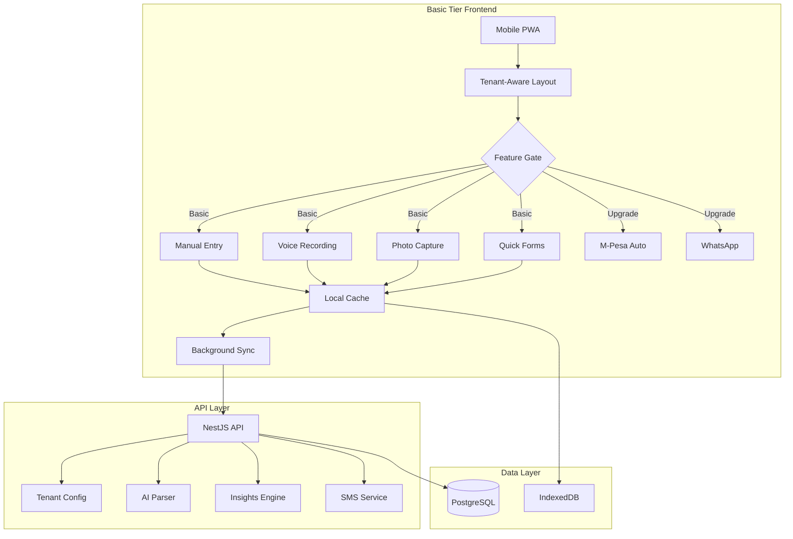

# Basic Tier Frontend for Nairobi's 80% Manual Commerce

## Executive Summary

This plan transforms the current [`bridge-manual`](apps/bridge-manual/) frontend into a **Basic Tier reference implementation** optimized for Nairobi's manual commerce users. The strategy focuses on maximizing digital value extraction from manual data entry while keeping the interface simple, mobile-first, and voice/camera-enabled.

---

## Current State Analysis

### What's Already Built ✅

**Backend (API):**
- ✅ Tenant system with tier-based feature flags ([`TenantConfigService`](apps/api/src/integrations/tenant-config.service.ts:18))
- ✅ Feature flag system in Prisma ([`FeatureFlag`](apps/api/prisma/schema.prisma:165) model)
- ✅ BASIC tier support with manual-only defaults ([`TenantsController`](apps/api/src/tenants/tenants.controller.ts:17))
- ✅ Dogfood tenant (janders-dogfood) with all integrations enabled
- ✅ Database schema supports transactions, entities, payments

**Frontend (bridge-manual):**
- ✅ [`TenantContext`](apps/bridge-manual/src/context/TenantContext.tsx:27) for tenant state management
- ✅ [`FeatureGate`](apps/bridge-manual/src/components/FeatureGate.tsx:37) component for conditional rendering
- ✅ [`QuickAddTransaction`](apps/bridge-manual/src/components/QuickAddTransaction.tsx:14) with mobile-optimized UI
- ✅ [`VoiceRecording`](apps/bridge-manual/src/components/VoiceRecording.tsx:16) component (basic Web Speech API)
- ✅ Basic dashboard ([`complex-dashboard.tsx`](apps/bridge-manual/src/app/complex-dashboard.tsx:10))

### Gaps Identified ❌

| Proposed Feature | Current State | Gap Severity |
|-----------------|---------------|--------------|
| Voice-to-transaction parsing | Basic recording only, no parsing | HIGH |
| Photo receipt capture | Not implemented | HIGH |
| SMS daily summaries | Not implemented | MEDIUM |
| AI-powered insights | Not implemented | HIGH |
| Customer debt tracking (Udhaari) | Basic entity management only | MEDIUM |
| Mobile-first PWA | Not configured | MEDIUM |
| Offline support | Not implemented | HIGH |
| Self-service signup | Admin-only tenant creation | MEDIUM |
| Nairobi business context engine | Not implemented | HIGH |
| Tenant subdomain routing | Not implemented | LOW |

---

## Proposed Architecture

### System Overview



### Basic Tier Feature Interface

```typescript
// packages/types/src/basic-tier-features.ts
export interface BasicTierFeatures {
  // Core Manual Features (Always Enabled)
  manual_transactions: true
  voice_recording: true
  photo_receipts: true
  quick_customer_management: true
  daily_summary_sms: true
  
  // Smart Insights (Value Return)
  sales_trends: true
  customer_insights: true
  payment_patterns: true
  profit_tracking: true
  low_stock_alerts: true
  
  // Upgrade Triggers (Disabled)
  mpesa_integration: false
  whatsapp_integration: false
  advanced_reports: false
  multi_user: false
  api_access: false
}
```

---

## Implementation Phases

### Phase 1: Foundation (Week 1)
**Goal:** Restructure bridge-manual as Basic Tier reference

- [ ] Move [`bridge-manual`](apps/bridge-manual/) → `packages/basic-tier-theme`
- [ ] Create tenant-aware layout with subdomain support
- [ ] Implement Basic tier feature interface
- [ ] Set up feature-gating system
- [ ] Create tenant slug-based routing

**Key Files to Modify:**
- [`apps/bridge-manual/src/app/layout.tsx`](apps/bridge-manual/src/app/layout.tsx:18) - Add tenant fetching
- [`apps/bridge-manual/src/context/TenantContext.tsx`](apps/bridge-manual/src/context/TenantContext.tsx:27) - Enhance with slug support
- [`apps/api/src/tenants/tenants.controller.ts`](apps/api/src/tenants/tenants.controller.ts:30) - Add public signup endpoint

### Phase 2: Value Creation (Week 2)
**Goal:** Implement smart data collection and insights

- [ ] Build voice-to-transaction parser (Nairobi Swahili/English mix)
- [ ] Create photo receipt capture component
- [ ] Implement AI insights dashboard
- [ ] Build Nairobi business context engine
- [ ] Create customer debt (Udhaari) tracking

**New Components:**
- `VoiceTransactionRecorder` - Parse "Ali ameleta vitunguu 500, amelipa 300"
- `PhotoReceiptCapture` - Camera integration for receipts
- `BasicDashboard` - Insights: "Your Tuesday sales are 30% higher"
- `CustomerDebtTracker` - "John owes 500 since 3 days"

### Phase 3: Self-Service (Week 3)
**Goal:** Enable instant Basic tier activation

- [ ] Build public signup flow
- [ ] Implement instant tenant creation
- [ ] Create welcome SMS system
- [ ] Set up subdomain auto-routing
- [ ] Add business type templates (duka, kiosk, service, transport)

**New API Endpoints:**
```typescript
POST /api/v1/tenants/signup-basic  // Public signup
GET  /:tenantSlug                  // Tenant-specific app
```

### Phase 4: Mobile Excellence (Week 4)
**Goal:** Optimize for Nairobi's mobile-first reality

- [ ] Configure PWA (manifest, service worker)
- [ ] Implement offline-first with IndexedDB
- [ ] Add background sync for poor connectivity
- [ ] Optimize for 3G (< 3s load time)
- [ ] Deploy Nairobi dogfood tenant

---

## User Personas & Workflows

### Mama Mboga (Vegetable Seller)
```
Morning Routine:
1. Open app → Voice: "Leo nimeuza mboga 2,450"
2. App parses: Sale KES 2,450, category: Agriculture
3. Evening: SMS arrives "Sales: 2,450 | Expenses: 500 | Profit: 1,950"
4. Weekly insight: "You sell 3x more on Saturdays - stock up!"
```

### Kinyozi (Barber)
```
Daily Use:
1. Quick tap: 5 customers × 100 = 500
2. Voice note: "John alikata na 150, amedai 50"
3. Dashboard shows: "5 customers today, 1 debt: John 50"
4. Month-end: "Your best day is Friday - consider staying open later"
```

### Duka Owner
```
Inventory + Sales:
1. Photo receipt from supplier → Auto-extract items
2. Voice: "Nimeuza mafuta 2, sukari 1kg"
3. Alert: "Sukari stock low - you sell 5kg/day"
4. Insight: "M-Pesa sales up 20% - consider phone payment discount"
```

---

## Technical Specifications

### Mobile-First Design Principles
- Touch targets ≥ 44px
- Large input fields (80px height for amount)
- Quick action buttons (100, 200, 500, 1000)
- Single-thumb navigation
- Offline indicator

### Voice Input Processing
```typescript
// Nairobi business speech patterns
interface ParsedVoiceInput {
  customer?: string      // "Ali", "John", "Mama Sarah"
  amount: number         // "mia tano" → 500
  payment: 'cash' | 'mpesa' | 'credit'  // "kwa mpesa", "alidai"
  item?: string          // "sukari", "mboga", "mafuta"
  quantity?: number      // "kilo mbili"
  action: 'sale' | 'purchase' | 'payment'
}
```

### Data Value Return System
Every data point collected returns value:

| Data Collected | Insight Generated |
|---------------|-------------------|
| Transaction amounts | Sales trends, peak hours |
| Payment methods | Payment pattern shifts |
| Customer names | Repeat customer tracking |
| Item descriptions | Stock alerts, popular items |
| Time of day | Peak hour recommendations |
| Location | Market comparison (anonymized) |

---

## Success Metrics

### Adoption
- Signups per day from Nairobi areas
- Daily active users (> 60% of signups)
- Voice/photo usage rate (> 40% of transactions)

### Value Return
- Daily insights opened per user
- SMS summary engagement rate
- Customer debt reduction tracking

### Technical
- App load time < 3s on 3G
- Offline functionality success rate
- Voice recognition accuracy for Nairobi accents

---

## Nairobi Dogfood Setup

```typescript
// Your test tenant
const nairobiTenant = await createBasicTenant({
  businessName: "Jander's Test Duka",
  ownerName: "Jabir Ahmed",
  phoneNumber: "+2547XXXXXXXX",
  businessType: "duka",
  location: "westlands"
})

// Access at: https://bridge.ke/janders-test-duka
// Features: Full Basic tier with voice, photo, SMS insights
```

---

## Recommendation

**This is an excellent strategic direction.** The plan correctly identifies:

1. **Real market need:** 80% of Nairobi commerce is manual
2. **Value exchange:** Data input → AI insights (not just storage)
3. **Mobile-first:** Phone is the primary business tool
4. **Cultural fit:** Voice, photo, SMS match local workflows
5. **Growth path:** Clear upgrade triggers to paid tiers

The phased approach is practical, and the focus on "digital value return" differentiates this from simple accounting apps.

**Ready to proceed with Phase 1?**
