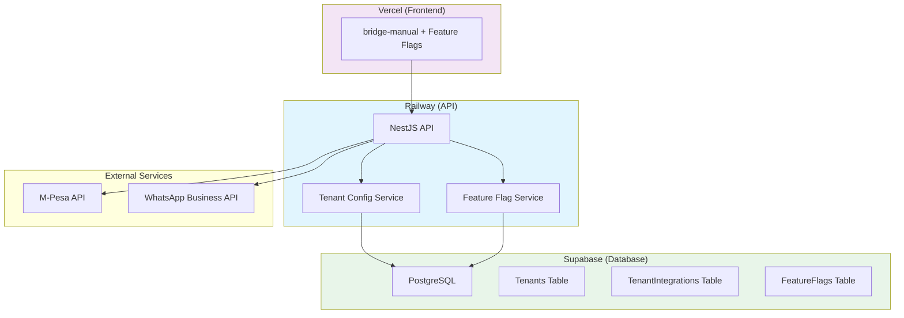

# Deployment Plan: Core with Manual Users + Dogfood Tenant

## Overview

Deploy the Project Bridge core system with:
- **Production API** on Railway
- **Production Frontend** on Vercel (bridge-manual base)
- **Dogfood tenant** (`janders-dogfood`) with full integrations (WhatsApp, M-Pesa)
- **Regular tenants** with manual-only features
- **Feature flag system** to control tenant access to integrations

---

## Architecture



---

## Tenant Feature Matrix

| Feature | Regular Tenants | janders-dogfood |
|---------|----------------|-----------------|
| Manual Transactions | ✅ | ✅ |
| Entity Management | ✅ | ✅ |
| Payment Records | ✅ | ✅ |
| Dashboard | ✅ | ✅ |
| M-Pesa Integration | ❌ | ✅ |
| WhatsApp Integration | ❌ | ✅ |
| QuickBooks Sync | ❌ | ✅ |
| Xero Sync | ❌ | ✅ |
| Shopify Sync | ❌ | ✅ |
| Advanced Reporting | ❌ | ✅ |

---

## Deployment Phases

### Phase 1: Database Setup & Migrations

**Goal**: Prepare Supabase database with tenant system

**Steps**:
1. Verify Supabase project is configured
2. Run Prisma migrations to create tenant tables
3. Verify `Tenant`, `TenantIntegration`, `FeatureFlag` tables exist
4. Create seed data for feature flags

**Files to modify**:
- `apps/api/prisma/schema.prisma` (verify existing)
- `apps/api/prisma/seed.ts` (add feature flags)

**Verification**:
```bash
cd apps/api
npx prisma migrate deploy
npx prisma db seed
```

---

### Phase 2: API Deployment (Railway)

**Goal**: Deploy NestJS API with tenant configuration

**Steps**:
1. Configure Railway project
2. Set environment variables
3. Deploy API
4. Verify health endpoint

**Required Environment Variables**:
```bash
# Database
DATABASE_URL=postgresql://...
DIRECT_URL=postgresql://...

# Supabase
SUPABASE_URL=https://...
SUPABASE_SERVICE_ROLE_KEY=...

# Security
JWT_SECRET=...
ENCRYPTION_KEY=...

# M-Pesa (for dogfood tenant)
MPESA_ENVIRONMENT=production
MPESA_CONSUMER_KEY=...
MPESA_CONSUMER_SECRET=...
MPESA_SHORTCODE=...
MPESA_PASSKEY=...
MPESA_CALLBACK_URL=https://api.yourdomain.com/api/v1/integrations/mpesa/stk-callback

# WhatsApp (for dogfood tenant)
WHATSAPP_PHONE_NUMBER_ID=...
WHATSAPP_ACCESS_TOKEN=...
WHATSAPP_WEBHOOK_VERIFY_TOKEN=...
```

**Verification**:
```bash
curl https://api.yourdomain.com/api/v1/health
```

---

### Phase 3: Frontend Deployment (Vercel)

**Goal**: Deploy bridge-manual with feature flag support

**Steps**:
1. Configure Vercel project
2. Set environment variables
3. Deploy frontend
4. Verify tenant-based feature rendering

**Required Environment Variables**:
```bash
NEXT_PUBLIC_API_URL=https://api.yourdomain.com/api/v1
NEXT_PUBLIC_APP_URL=https://app.yourdomain.com
```

**New Components Needed**:
- `FeatureGate` component - conditionally render based on tenant features
- `IntegrationPanel` component - show/hide integration settings
- Tenant context provider

---

### Phase 4: Create Dogfood Tenant

**Goal**: Set up `janders-dogfood` tenant with full integrations

**Steps**:
1. Create tenant record in database
2. Enable all feature flags for this tenant
3. Configure M-Pesa integration
4. Configure WhatsApp integration
5. Create admin user for tenant

**Database Records**:
```sql
-- Create tenant
INSERT INTO tenants (id, name, slug, tier, country, is_active, settings)
VALUES (
  'janders-dogfood-uuid',
  'Janders Dogfood',
  'janders-dogfood',
  'ENTERPRISE',
  'KE',
  true,
  '{"features": ["mpesa", "whatsapp", "quickbooks", "xero", "shopify"]}'
);

-- Enable integrations
INSERT INTO tenant_integrations (tenant_id, integration_type, is_active, encrypted_config)
VALUES 
  ('janders-dogfood-uuid', 'MPESA', true, '{}'),
  ('janders-dogfood-uuid', 'WHATSAPP', true, '{}');
```

---

### Phase 5: Tenant Provisioning System

**Goal**: Create system for onboarding new manual-only tenants

**Steps**:
1. Create tenant provisioning API endpoint
2. Create self-service signup flow
3. Set default feature flags (manual only)
4. Send welcome email

**New API Endpoints**:
- `POST /api/v1/tenants` - Create new tenant
- `GET /api/v1/tenants/:id/features` - Get tenant features
- `POST /api/v1/tenants/:id/integrations` - Request integration (admin only)

**Default Features for New Tenants**:
```json
{
  "manual_transactions": true,
  "entity_management": true,
  "payment_records": true,
  "dashboard": true,
  "mpesa": false,
  "whatsapp": false,
  "quickbooks": false,
  "xero": false,
  "shopify": false
}
```

---

### Phase 6: Feature Flag System

**Goal**: Implement runtime feature flag checks

**Implementation**:

1. **Backend** - Extend `TenantConfigService`:
```typescript
async getTenantFeatures(tenantId: string): Promise<FeatureFlags> {
  const tenant = await this.prismaService.tenant.findUnique({
    where: { id: tenantId },
    include: { featureFlags: true }
  });
  
  return this.calculateFeatures(tenant);
}

async isFeatureEnabled(tenantId: string, feature: string): Promise<boolean> {
  const features = await this.getTenantFeatures(tenantId);
  return features[feature] === true;
}
```

2. **Frontend** - Create `FeatureGate` component:
```tsx
export function FeatureGate({ 
  feature, 
  children, 
  fallback = null 
}: FeatureGateProps) {
  const { tenant } = useTenant();
  const hasFeature = tenant?.features?.[feature];
  
  return hasFeature ? children : fallback;
}
```

3. **Usage Example**:
```tsx
<FeatureGate feature="mpesa">
  <MpesaPaymentButton />
</FeatureGate>

<FeatureGate feature="whatsapp" fallback={<ManualContact />}>
  <WhatsAppButton />
</FeatureGate>
```

---

### Phase 7: Testing & Verification

**Test Scenarios**:

1. **Dogfood Tenant** (`janders-dogfood`):
   - ✅ Can create manual transactions
   - ✅ Can use M-Pesa STK push
   - ✅ Can send WhatsApp notifications
   - ✅ Can sync with QuickBooks/Xero

2. **Regular Tenant** (new signup):
   - ✅ Can create manual transactions
   - ✅ Can manage entities
   - ✅ Cannot see M-Pesa option
   - ✅ Cannot see WhatsApp option
   - ✅ Sees "Upgrade for integrations" prompt

3. **API Security**:
   - ✅ Regular tenant cannot access integration endpoints
   - ✅ 403 Forbidden returned for unauthorized features

---

## File Changes Required

### Backend Changes

| File | Change |
|------|--------|
| `apps/api/src/integrations/tenant-config.service.ts` | Add `getTenantFeatures()`, `isFeatureEnabled()` |
| `apps/api/src/integrations/integrations.controller.ts` | Add middleware to check tenant features |
| `apps/api/src/integrations/integrations.module.ts` | Add feature guard |
| `apps/api/src/auth/auth.guard.ts` | Add tenant feature check |
| `apps/api/prisma/seed.ts` | Add feature flags seed data |

### Frontend Changes

| File | Change |
|------|--------|
| `apps/bridge-manual/src/components/FeatureGate.tsx` | New component |
| `apps/bridge-manual/src/context/TenantContext.tsx` | New context provider |
| `apps/bridge-manual/src/hooks/useTenantFeatures.ts` | New hook |
| `apps/bridge-manual/src/app/page.tsx` | Wrap features with FeatureGate |
| `apps/bridge-manual/src/components/IntegrationPanel.tsx` | New component for integration settings |

### New Files

| File | Purpose |
|------|---------|
| `apps/api/src/common/guards/feature.guard.ts` | Guard for feature-protected routes |
| `apps/api/src/tenants/tenants.controller.ts` | Tenant management endpoints |
| `apps/api/src/tenants/tenants.service.ts` | Tenant provisioning logic |
| `apps/bridge-manual/src/types/tenant.ts` | Tenant type definitions |

---

## Environment Configuration

### Production Environment Variables

**API (Railway)**:
```bash
NODE_ENV=production
PORT=3000
API_URL=https://api.bridge.app
FRONTEND_URL=https://app.bridge.app

# Database
DATABASE_URL=postgresql://...
DIRECT_URL=postgresql://...

# Supabase
SUPABASE_URL=https://...
SUPABASE_SERVICE_ROLE_KEY=...
SUPABASE_JWT_SECRET=...

# Security
JWT_SECRET=...
ENCRYPTION_KEY=...

# M-Pesa (dogfood only)
MPESA_ENVIRONMENT=production
MPESA_CONSUMER_KEY=...
MPESA_CONSUMER_SECRET=...
MPESA_SHORTCODE=...
MPESA_PASSKEY=...
MPESA_CALLBACK_URL=https://api.bridge.app/api/v1/integrations/mpesa/stk-callback

# WhatsApp (dogfood only)
WHATSAPP_PHONE_NUMBER_ID=...
WHATSAPP_BUSINESS_ACCOUNT_ID=...
WHATSAPP_ACCESS_TOKEN=...
WHATSAPP_WEBHOOK_VERIFY_TOKEN=...
```

**Frontend (Vercel)**:
```bash
NEXT_PUBLIC_API_URL=https://api.bridge.app/api/v1
NEXT_PUBLIC_APP_URL=https://app.bridge.app
```

---

## Rollback Plan

If issues occur:

1. **Database**: Restore from Supabase backup
2. **API**: Rollback to previous Railway deployment
3. **Frontend**: Rollback to previous Vercel deployment
4. **Tenant Data**: Dogfood tenant can be disabled without affecting other tenants

---

## Post-Deployment Checklist

- [ ] API health check passes
- [ ] Frontend loads without errors
- [ ] Dogfood tenant can access all features
- [ ] New tenant signup creates manual-only tenant
- [ ] Feature flags correctly restrict access
- [ ] M-Pesa callbacks work for dogfood tenant
- [ ] WhatsApp webhooks work for dogfood tenant
- [ ] Monitoring alerts configured
- [ ] Error tracking active
